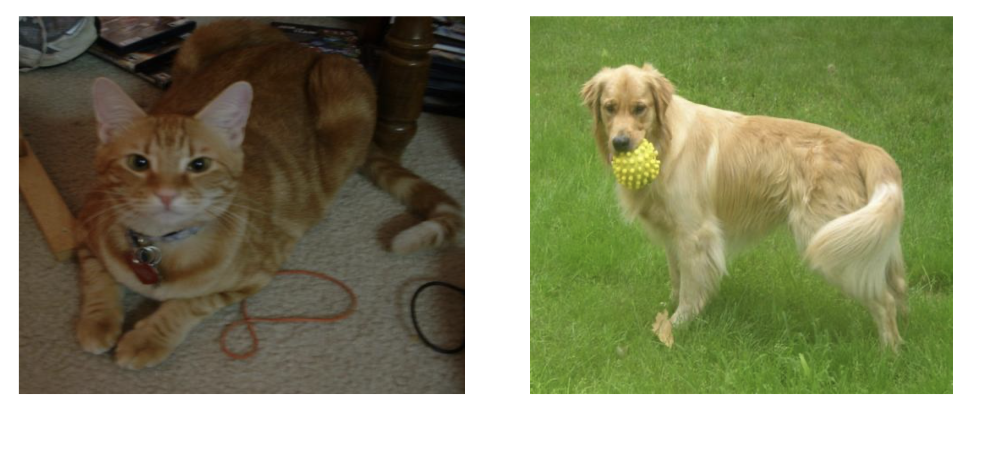
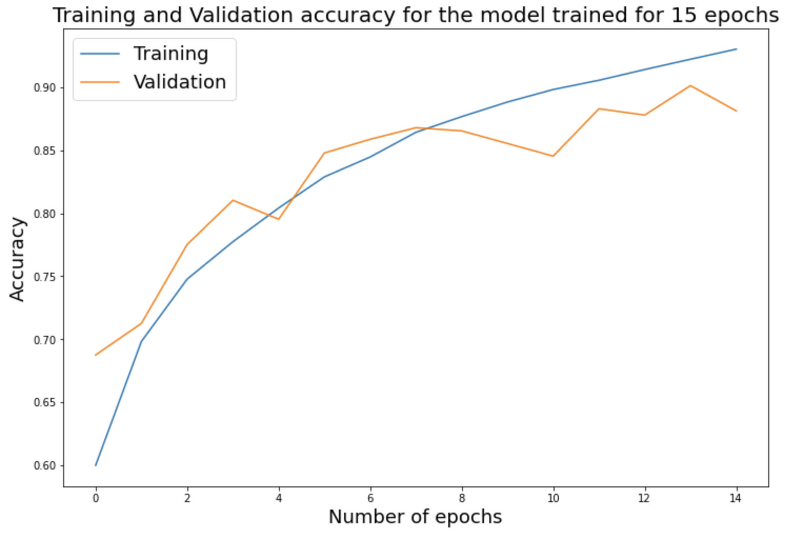

# cats_and_dogs
In this project, I have trained a Convolutional Neural Network to classify an image as a cat or a dog. The training was carried out on a total of about 12000 images of cats and dogs, which were separated into Training and Validation. The data preparation part, which includes downloading the images and separating them for Training and Validation is shown in this [notebook](https://colab.research.google.com/drive/1Ku3Aec4ZDWCX9GVCF7f8SrXVu-6hgD78?usp=sharing)

The code used to train the model is in the file `classify_cats_and_dogs.py` and the model details are stored in the file `cats_and_dogs.h5`.
The file `history.pkl` contains the training and validation accuracy and loss. After training on 15 epochs, the model achieved a validation and training accuracy of **88.13**% and **93.03**% respectively.

